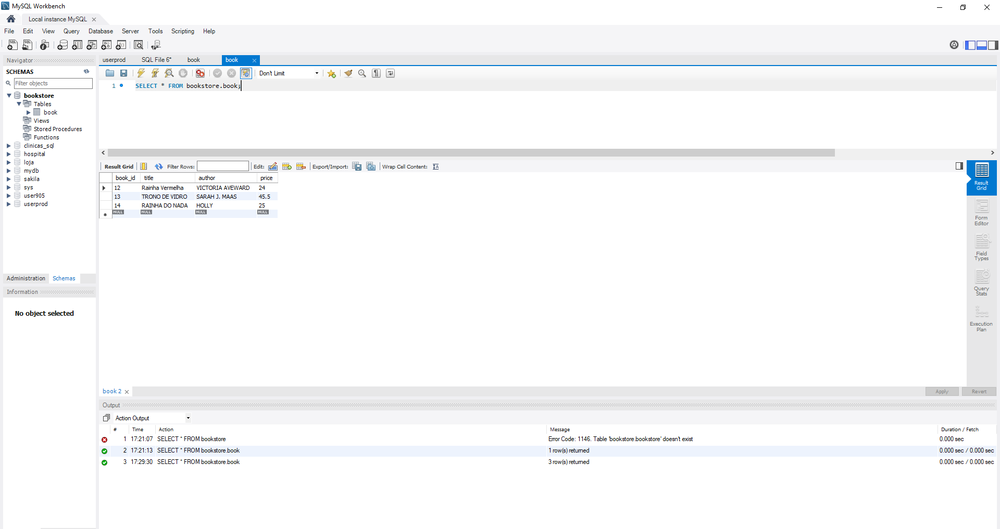

# SWII5  - Books Management

Uma aplicação CRUD (Create, Read, Update and Delete).

## Requisitos

Atenção:

[x]  Obrigatório o nome da dupla nos arquivos .java na forma de comentários.

[x] Deverá entregar o projeto em forma compactada (toda a pasta)

[x] Diferencial: Criar uma página específica para créditos da dupla.

## Demonstração

Tela do MYSQL

Link do projeto funcionando: https://youtu.be/7QMhVpXSiaU

## Autores

- Andreza do Nascimento Pessoa  Matricula: Cb3012191
- Lidiane Souza Soares  Matricula: CB3012026
